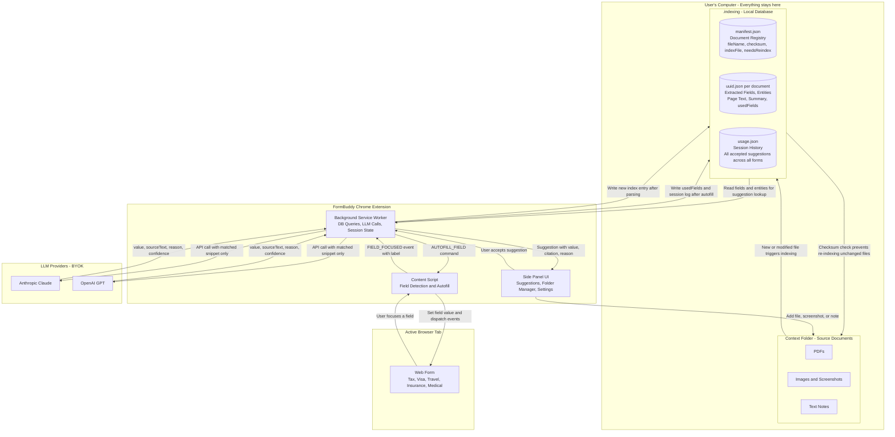
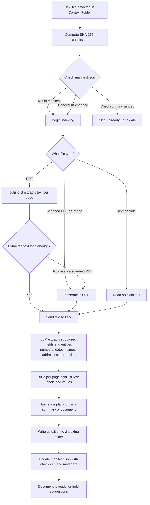
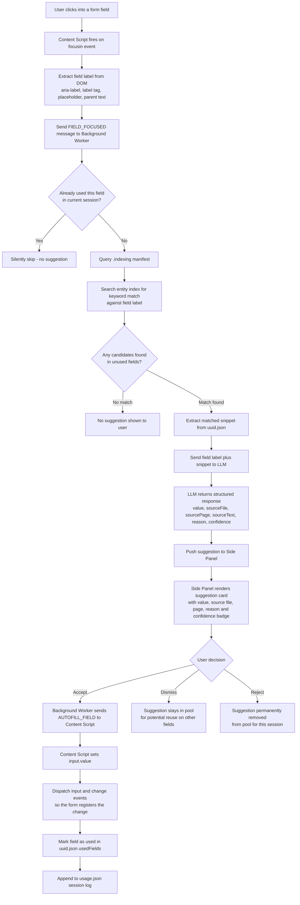
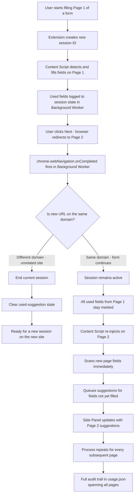
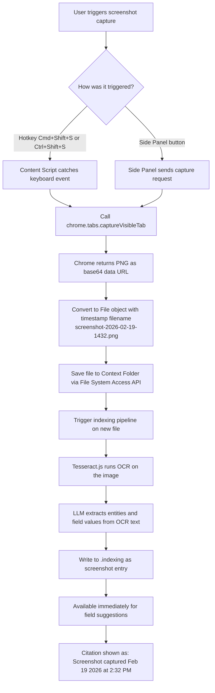

# FormBuddy — System Flow Diagrams

---

## 1. Overall System Architecture

The `.indexing` folder is the core local database of the entire app. Every read, write, and suggestion flows through it. Nothing is stored on any server.



---

## 2. Document Indexing Flow

Triggered automatically whenever a file is added or modified in the context folder.



---

## 3. Form Field Suggestion Flow

Triggered every time the user focuses a field on any web form.



---

## 4. Multi-Page Form and Redirect Flow

Ensures the session and used-suggestion state survive across page navigations.



---

## 5. Screenshot Capture Flow

Triggered by hotkey or Side Panel button to capture on-screen information.



---

## 6. BYOK API Key Setup Flow

How the user connects their LLM provider. No payment data ever passes through FormBuddy.

```mermaid
flowchart TD
    A["User opens FormBuddy Settings popup"] --> B["Clicks Connect AI Provider"]
    B --> C{"Which provider?"}

    C -->|"Anthropic Claude"| D["Open console.anthropic.com in new tab"]
    C -->|"OpenAI GPT"| E["Open platform.openai.com in new tab"]

    D --> F["User creates account on provider platform"]
    E --> F

    F --> G["User adds credits directly with provider\nNo payment info touches FormBuddy"]
    G --> H["User generates API key on provider dashboard"]
    H --> I["User copies API key"]
    I --> J["User pastes key into FormBuddy Settings"]
    J --> K["Extension sends lightweight test API call\nto verify the key works"]

    K --> L{"Key valid?"}
    L -->|"Invalid"| M["Show error message\nAsk user to check and re-enter"]
    M --> J
    L -->|"Valid"| N["Encrypt key and store in chrome.storage.local\nsandboxed to this extension only"]

---

## 7. End-to-End Sequence Diagram (Current Flow)

```mermaid
sequenceDiagram
    autonumber
    participant U as "User"
    participant SP as "SidePanel UI"
    participant BG as "Background Worker"
    participant CS as "Content Script"
    participant IDX as ".indexing Store"
    participant LLM as "LLM Provider (Claude/OpenAI/Gemini)"
    participant TAB as "Active Web Form Tab"

    U->>SP: Choose folder / change folder
    SP->>IDX: Read files + manifest
    loop "Per file"
        SP->>BG: Index request (via indexer pipeline)
        BG->>IDX: Read checksum / previous entries
        alt "Changed or new file"
            BG->>BG: Parse PDF or OCR/image extraction
            alt "API key present"
                BG->>LLM: Search-index + extraction prompts
                LLM-->>BG: Structured fields/autofill/entities
            end
            BG->>IDX: Write document index + search index + manifest
        else "Unchanged"
            BG-->>SP: Skip indexing
        end
    end
    SP->>BG: CONTEXT_UPDATED (selected docs only)

    U->>TAB: Open a webpage form
    TAB->>CS: Page loads
    CS->>BG: FORM_SCHEMA (best-effort snapshot)

    U->>SP: Paste field list in "Fields From Doc"
    U->>SP: Click "Fetch Fields From Doc"
    SP->>BG: MANUAL_FIELD_FETCH {fields[]}

    alt "API key present"
        BG->>BG: Build docs payload (search index + parsed fallback)
        BG->>LLM: One bulk mapping call for requested fields
        LLM-->>BG: Field-value mappings + confidence
    else "No API key"
        BG->>BG: Local deterministic matching only
    end

    BG->>BG: Fill unmatched items via local fallback
    BG-->>SP: Fetch response {results[], reason?}
    SP-->>U: Render result cards with Copy buttons

    U->>SP: Click Copy
    SP-->>U: Value copied to clipboard

    opt "Optional hover/focus autofill flow"
        U->>TAB: Focus form field
        CS->>BG: FIELD_FOCUSED
        BG->>IDX: Query indexed context
        BG->>LLM: Suggestion ranking (if API key)
        LLM-->>BG: Suggested value
        BG-->>CS: NEW_SUGGESTION
        CS-->>U: Top overlay suggestion (Fill / Dismiss / Space copy)
        U->>CS: Fill
        CS->>TAB: Set input value + dispatch events
        CS->>BG: SUGGESTION_ACCEPTED
        BG->>IDX: Update usage state
    end
```

    N --> O["Extension is ready to make LLM calls"]
    O --> P["User controls spending via provider dashboard"]
    P --> Q["FormBuddy never sees billing or payment details"]
```
